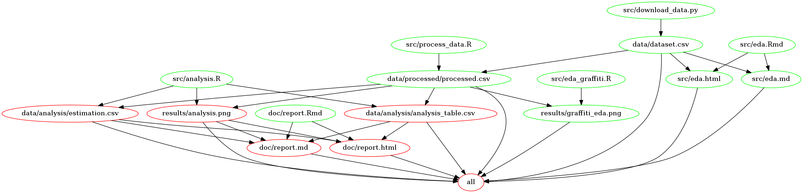

# DSCI_522_Group_34

- Contributors: Kangbo Lu, Siqi Zhou, Mitchie Zhao, Mengyuan Zhu

A data analysis project of group 34 for DSCI 522 (Data Science workflows); a
course in the Master of Data Science program at the University of
British Columbia.

## About

Here we attempt to conduct a two-tailed permutation test 
to answer a statistical research question, that is, whether 
the number of graffiti per location of Vancouver's downtown area 
differs from the number of graffiti per location of the Vancouver 
Strathcona area. We proposed to sequentially do exploratory data 
analysis, determine what features and columns to be retrieved to support 
our permutation testing, and attach with a suitable test flavour as median
to verify whether the median number of graffiti per location 
of Vancouver's downtown area differs from Vancouver's Strathcona area. 
After conducting exploratory data analysis and hypothesis testing, the results show 
there is no statistically significant difference between the 
median of counts of graffiti per recorded location in these 2 areas in Vancouver
since the p-value is 1 and it's larger than the significance level of 0.05.

In the research project, the dataset provides information on the location of sites with graffiti as identified by the Vancouver city staff. The graffiti location data is sourced from the Vancouver Open Data Portal and it can be found [here](https://opendata.vancouver.ca/pages/home/), specifically [this file](https://opendata.vancouver.ca/explore/dataset/graffiti/download/?format=csv&timezone=Asia/Shanghai&lang=en&use_labels_for_header=true&csv_separator=%3B). As for the data schema, there are three columns related to our research interest. The columns are named as "COUNT", "GEO LOCAL AREA" and "GEOM". We utilized the "COUNT" and the "GEO LOCAL AREA" columns to conduct a permutation test with the difference in medians to study the graffiti situation in the Vancouver Downtown area and the Vancouver Strathcona area.

## Report

The final report can be found
[here](./doc/report.md).

## Project Collaboration
We created the following 4 files that are important for collaboration:
  1. [Team work contract](https://github.com/UBC-MDS/DSCI_522_Group_34/blob/main/TEAM_WORK_CONTRACT.md)
  2. [Code of Conduct file](https://github.com/UBC-MDS/DSCI_522_Group_34/blob/main/CODE_OF_CONDUCT.md)
  3. [Contributing file](https://github.com/UBC-MDS/DSCI_522_Group_34/blob/main/CONTRIBUTING.md)
  4. [License file](https://github.com/UBC-MDS/DSCI_522_Group_34/blob/main/LICENSE.md)

## Usage  

To replicate the analysis, clone this GitHub repository, install the dependencies listed below, and run the following commands at the command line/terminal from the root directory of this project:


```
make all
```
To reset the repo to a clean state, with no intermediate or results files, run the following command at the command line/terminal from the root directory of this project:

```
make clean
```

## Makefile Dependency Diagram
Click the image below to view it with the original size.


## Dependencies

  - Python 3.8.3 and Python packages:
      - docopt==0.6.2
      - requests==2.23.0
      - pandas==1.1.1

  - R version 4.0.2 and R packages:
      - knitr==1.29
      - docopt==0.7.1
      - tidyverse==1.3.0
      - ggplot2==3.3.2
      - RCurl==1.98.1.2
      - infer==0.5.3

## License

The DSCI_522_Group_34 materials here are licensed under 
the MIT License Copyright (c) 2020 DSCI_522_Group_34. 
If re-using/re-mixing please provide attribution and link to this webpage.

# References

<div id="refs" class="references hanging-indent">

<div id="moderndive">

Modern Dive: An Introduction to Statistical and Data Sciences via R 
by Chester Ismay and Albert Y. Kim. <https://moderndive.com/index.html>.

</div>

<div id="quantile">

Quantile estimation by Thomas Bzik. 
<https://www.astm.org/SNEWS/images/ja14_dp.pdf>.

</div>

<div id="sml">

The missing question in supervised learning blog 
post by Vincenzo Coia. <https://github.com/vincenzocoia/vincenzocoia.github.io/blob/b9a5b5023e7d3dc0b135c032c7b1aa67376240db/_posts/2018-02-18-mean.md>.

</div>

<div id="data">

“Graffiti.” City of Vancouver Open Data Portal, 3 Feb. 2020,
<https://opendata.vancouver.ca/explore/dataset/graffiti/information/>.

</div>

</div>
