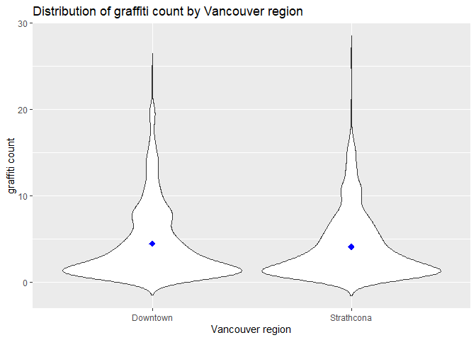
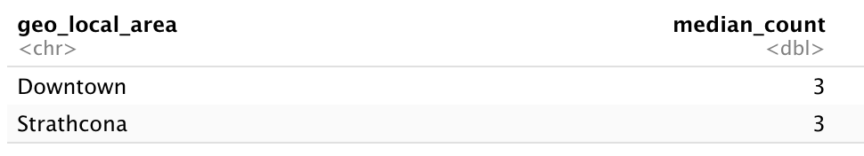
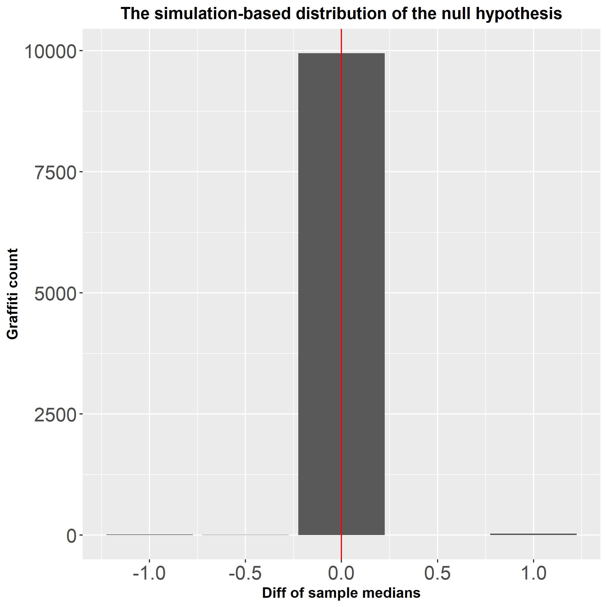
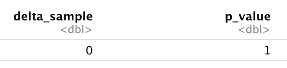

```{r setup, include=FALSE}
knitr::opts_chunk$set(echo = FALSE)
library(knitr)
library(tidyverse)
```

# Summary

In this research project, we tried to answer the research question of whether the number of graffiti of Vancouver's Downtown area is the same as the number of graffiti of Vancouver's Strathcona area.

Due to the skewness of our sample distribution, we used the median as the test statistics and set the $\alpha = 0.05$ with the two-tailed permutation test method to study the difference in the median.

For statistical analysis, we conducted a simulation with 10000 permutation replicates, plotted the confidence interval of the simulated null-distribution with the test statistics, and calculated the p-value to draw the conclusion.

# Introduction

Here we attempted to conduct a hypothesis test with a suitable test flavor
to answer a statistical research question, that is, whether 
the number of graffiti of Vancouver's downtown area 
differs from the number of graffiti of the Vancouver 
Strathcona area [@graffiti]. 

We proposed to sequentially do exploratory data 
analysis, determine what features and columns to be retrieved to support 
our hypothesis testing, and attach with a suitable test flavor 
to verify whether the median number of graffiti per location 
of Vancouver's downtown area differs from the median number of 
graffiti per location of Vancouver's Strathcona area [@moderndive]. 

According to the data visualizations, a suitable estimator for 
our research question is the median since we are interested in 
the most common number of graffiti in the two regions and 
the median is not as sensitive to extreme values as it is 
mathematically defined by the the 50th percentile of a distribution [@quantile].

The R and Python programming languages [@R; @Python] and the following R and Python packages were used to perform the analysis: docopt [@docopt], knitr [@knitr], tidyverse [@tidyverse], ggplot2 [@ggplot2], infer [@infer]. The code used to perform the analysis and create this report can be found here: https://github.com/UBC-MDS/DSCI_522_Group_34/blob/main/src/analysis.R.

# Methods

## Exploratory Data Analysis
The dataset used in this project provides information on the location of sites with graffiti as identified by City staff. It was sourced from the Vancouver Open Data Portal, specifically [this file](https://opendata.vancouver.ca/explore/dataset/graffiti/information). The license of data can be found [here](https://opendata.vancouver.ca/pages/home/).

```{r distribution in eda, echo=FALSE, fig.cap="Figure 1. Distribution of graffiti count by Vancouver region: downtown and Strathcona area", out.width = '60%'}

```

After conducting exploratory data analysis, we chose the median as the estimator. From the above violin plot of the distributions of two classes, we can observe the sample distributions are skewed to the right. The long right tail of the distributions also makes the median a suitable test flavor, since the median is not as sensitive to extreme values as it is mathematically defined by the 50th percentile of a distribution.

## Statistical Analysis

To estimate the sampling distribution of the test statistic we need many samples generated under the null hypothesis.
If the null hypothesis is true, changing the exposure would have no effect on the outcome. By randomly shuffling the exposures we can make up as many ‘null’ data sets as we like.
If the null hypothesis is true, the shuffled data sets should look similar to the real data. Otherwise, they should look different from the real data.
Comparing the shuffled test statistics to the real test statistics gives a p-value. Then, we compared the p-value with our defined threshold $\alpha = 0.05$ to draw the conclusion for our research question.

**Estimator:**  
median number of graffiti per recorded location

**Hypothesis**  
$H_0$: the median number of graffiti per recorded location of Vancouver Downtown area is the same as the median number of graffiti per recorded location of Vancouver Strathcona area

$H_a$: the median number of graffiti per recorded location of Vancouver Downtown area is not the same as the median number of graffiti per recorded location of Vancouver Strathcona area

**Test Flavor**  
Two tailed permutation test for the median.  

**Test Statistics**  
We used delta to represent the difference between the median counts of graffiti in each area.

## Results & Discussion
First we calculated the median values of the counts of the 2 areas of our interest.
The medians of the count of graffiti per location of the two areas are listed below:

```{r median value of the 2 classes, echo=FALSE, fig.cap="Table 1. Results of computed median values of the 2 classes", out.width = '40%'}

```

To look at whether our null hypothesis is valid, we conducted a simulation with 10000 permutation replicates with the differences in medians. The figure below visualizes the simulated null distribution with the test statistics.

```{r null-distributions, echo=FALSE, fig.cap="Figure 2. The simulation-based distribution of the null hypothesis", out.width = '40%'}

```

Then, we calculated the corresponding p-value of the null distribution for drawing the conclusion:

```{r p-values, echo=FALSE, fig.cap="Table 2. The corresponding p-value of the null hypothesis", out.width = '40%'}

```

The test statistics is 0 for the sample. The calculated p-value is 1, which is larger than 0.05. It indicated that there is no statistically significant difference between the median of counts of graffiti per recorded location in the 2 areas in Vancouver. We don’t have enough confidence to reject the null hypothesis that the median number of graffiti per recorded location of Vancouver Downtown area is the same as the median number of graffiti per recorded location of Vancouver Strathcona area.

Future work includes further exploratory data analysis to take full advantage of the coordinate data on the map to understand the distribution of graffiti in different areas of Vancouver. To analyze the Downtown and Strathcona area is a bit segmentary to represent the whole regional situation of Vancouver. We would study and observe the graffiti situation and differences in other areas based on a more macroscopic perspective. Another hypothesis testing might be conducted as a statistical analysis comparison of our current permutation test. Meanwhile, we also might improve the preprocessing to eliminate redundant and unrepresentative data points since there are many zero values in terms of Downtown and Strathcona areas, leading to a very centralized distribution. 


# References

